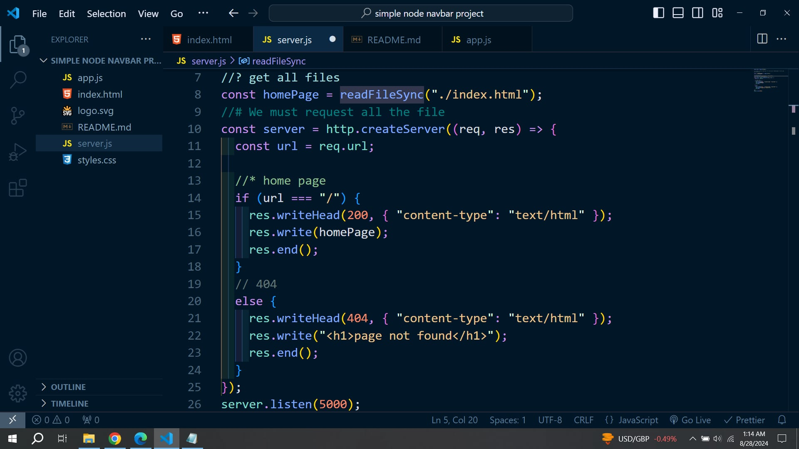
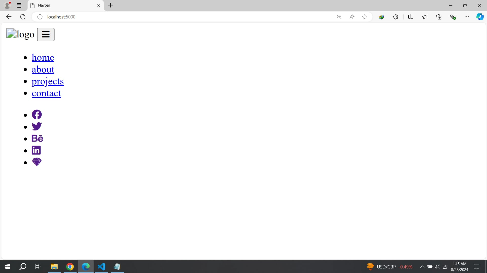
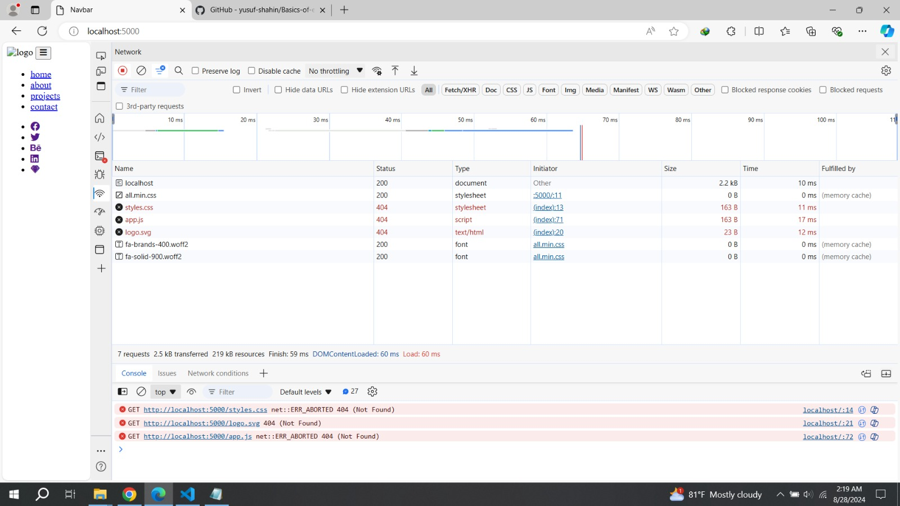
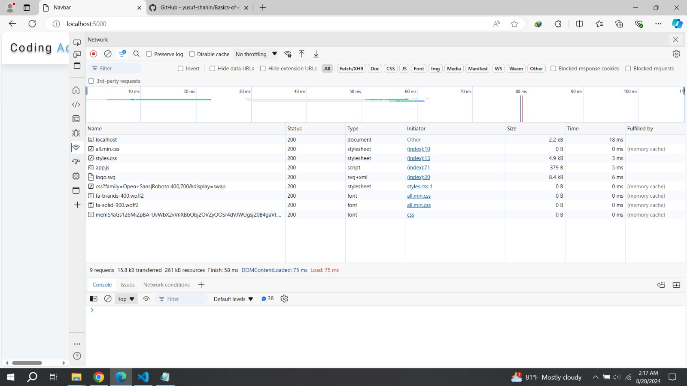

# Navbar Project

- How can I run a project using local server. Setup the server just **HTTP Modules**

#### How HTTP module basically work ?

- [**Click Here**](https://github.com/yusuf-shahin/Basics-of-express.js)

### Start from basic :-

- create a **index.html** file.
- create a **style.css** file.
- create a **app.js** file.
- create a **server.js** file, where I build the server using _HTTP module_.

**import http**
`const http = require("http");`

**we get a obj by importing "fs" and we get "readFileSync" file by obj destructering.**
`const { readFileSync } = require("fs");`

**Read the file**
`const homePage = readFileSync("./index.html");`

**Create the server**

```js
const server = http.createServer((req, res) => {
  const url = req.url;

  //* home page
  if (url === "/") {
    res.writeHead(200, { "content-type": "text/html" });
    res.write(homePage);
    res.end();
  }
  // 404
  else {
    res.writeHead(404, { "content-type": "text/html" });
    res.write("<h1>page not found</h1>");
    res.end();
  }
});
```

**listen the server**
`server.listen(5000);`

- **the code**



- **the browser**



- **_What is the problem ?_**

- if we `console.log(url)` and refreash the browser . We get four things in terminal.

```js
/
/styles.css
/app.js
/logo.svg
```

- In **_HTML Content_** browser start to reading its get different different path .
- The paths are --> **_./styles.css_**, **_./logo.svg_**, **_./app.js_**
- except `/` , every things else we have **404**

**IN Network**


### The solution :-

**So we will have to request all the file and assign them in varible**

```js
const homePage = readFileSync("./index.html");
const homeStyles = readFileSync("./styles.css");
const homeImage = readFileSync("./logo.svg");
const homeLogic = readFileSync("./app.js");
```

**add all this resources**

```js
//* home page
if (url === "/") {
  //# "text/html"
  res.writeHead(200, { "content-type": "text/html" });
  res.write(homePage);
  res.end();
}

// //* styles
else if (url === "/styles.css") {
  //# "text/css"
  res.writeHead(200, { "content-type": "text/css" });
  res.write(homeStyles);
  res.end();
}

// //* image/logo
else if (url === "/logo.svg") {
  //# "image/svg+xml"
  res.writeHead(200, { "content-type": "image/svg+xml" });
  res.write(homeImage);
  res.end();
}
//* logic
else if (url === "/app.js") {
  //# "text/javascript"
  res.writeHead(200, { "content-type": "text/javascript" });
  res.write(homeLogic);
  res.end();
}

//* 404
else {
  //# "text/html"
  res.writeHead(404, { "content-type": "text/html" });
  res.write("<h1>page not found</h1>");
  res.end();
}
```

- **In Network**



### The whole code of **server.js** is :-

```js
const http = require("http");

//? we get a obj by importing "fs" and we get "readFileSync" file by obj destructering.

const { readFileSync } = require("fs");

//? get all files
const homePage = readFileSync("./index.html");
const homeStyles = readFileSync("./styles.css");
const homeImage = readFileSync("./logo.svg");
const homeLogic = readFileSync("./app.js");

//# We must request all the file

const server = http.createServer((req, res) => {
  const url = req.url;

  //* to see the url path :-
  // console.log(url);

  //* home page
  if (url === "/") {
    //# "text/html"
    res.writeHead(200, { "content-type": "text/html" });
    res.write(homePage);
    res.end();
  }

  // //* styles
  else if (url === "/styles.css") {
    //# "text/css"
    res.writeHead(200, { "content-type": "text/css" });
    res.write(homeStyles);
    res.end();
  }

  // //* image/logo
  else if (url === "/logo.svg") {
    //# "image/svg+xml"
    res.writeHead(200, { "content-type": "image/svg+xml" });
    res.write(homeImage);
    res.end();
  }
  //* logic
  else if (url === "/app.js") {
    //# "text/javascript"
    res.writeHead(200, { "content-type": "text/javascript" });
    res.write(homeLogic);
    res.end();
  }

  //* 404
  else {
    //# "text/html"
    res.writeHead(404, { "content-type": "text/html" });
    res.write("<h1>page not found</h1>");
    res.end();
  }
});

server.listen(5000);
```

- in terminal **node server.js**
- **localhost:500**
